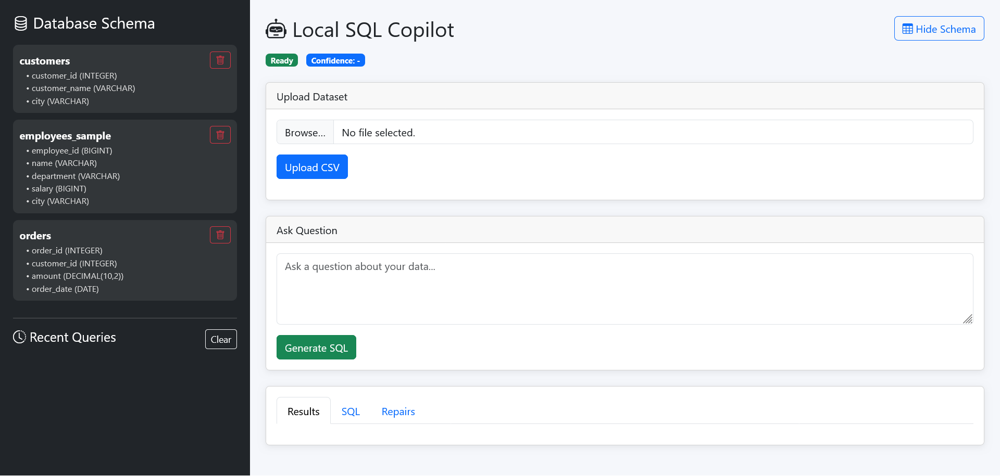

# Local SQL Copilot




Local SQL Copilot is a modern AI-assisted SQL workspace built with **FastAPI**, **DuckDB**, and **Ollama**. It provides natural language querying, dynamic schema discovery, CSV-to-table ingestion, SQL validation, automatic query repair, export capabilities, and Dockerized deployment, enabling users to analyze data efficiently while keeping everything local and private.


## Features

### 🤖 Natural Language → SQL

Convert plain English questions into executable SQL queries using a local LLM.

Examples:

* Show all customers from Chennai
* Count total orders
* Top customers by revenue
* Average order amount by city


### 🗂️ Schema Explorer

Browse database structure directly from the dashboard.

* View tables
* View columns and data types
* Refresh automatically after uploads
* Show / Hide schema panel


### 📤 CSV Upload

Upload CSV files and instantly query them.

* Automatic table creation
* Schema detection
* Dynamic table registration
* Immediate query support


### 🛡️ SQL Validation & Repair

Built-in safety and reliability layer.

* Query validation
* Automatic SQL repair
* Confidence scoring
* Error handling and retries


### 📊 Export Results

Download query results in multiple formats.

* CSV Export
* Excel Export (.xlsx)


### 🗑️ Table Management

Manage uploaded datasets directly from the UI.

* Delete tables
* Confirmation prompts
* Automatic schema refresh


## Architecture

```text
Browser
   │
   ▼
FastAPI
   │
   ├── Static Frontend
   ├── Query Engine
   ├── Schema Manager
   ├── CSV Loader
   └── Export Service
           │
           ▼
       DuckDB
           │
           ▼
        Ollama
```


## 🛠️ Tech Stack

### Backend

* FastAPI
* DuckDB
* Pandas
* Ollama
* Python

### Frontend

* HTML
* CSS
* JavaScript
* Bootstrap 5

## ⚙️ Getting Started

### 1️⃣ Clone Repository

```bash
git clone https://github.com/<your-username>/local-sql-copilot.git

cd local-sql-copilot
```


### 2️⃣ Create Virtual Environment

#### Windows

```bash
python -m venv venv

venv\Scripts\activate
```

#### Linux / macOS

```bash
python -m venv venv

source venv/bin/activate
```


### 3️⃣ Install Dependencies

```bash
pip install -r requirements.txt
```


### 4️⃣ Install Ollama

Download and install Ollama:

https://ollama.com

Pull the model:

```bash
ollama pull qwen3:4b
```

Start Ollama:

```bash
ollama serve
```


### 5️⃣ Run Application

```bash
uvicorn app.main:app --reload
```

Open:

```text
http://localhost:8000
```


## 🐳 Run with Docker

Build and start the application:

```bash
docker compose up --build
```

Open:

```text
http://localhost:8000
```


## 🔒 Security

The application blocks destructive database operations including:

* DROP
* DELETE
* TRUNCATE
* ALTER

Only safe analytical queries are executed.
